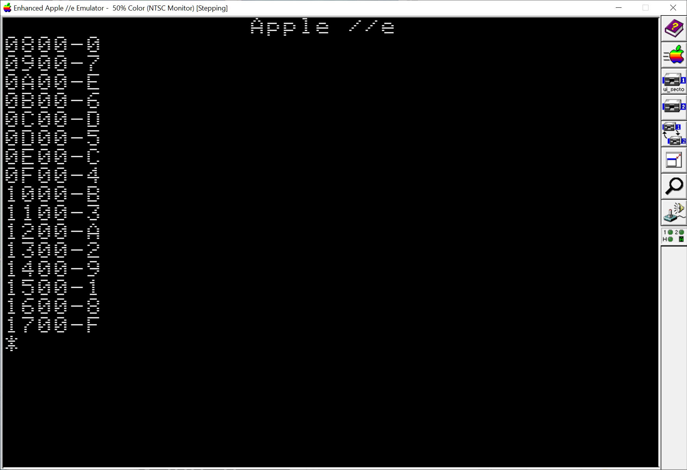

# Disk Sector Load Order

1. Use Copy \]\[+  Sector Editor and mark the first byte of every sector on Track 0.
2. Boot Disk

The address of the physical sectors loaded will be displayed.



# Boot Sector

```
800:10 8D E8 C0 A2 08 A0 00
808:84 3C 86 3D 20 92 FD B1
810:3C 20 E3 FD E6 3D A5 3D
818:C9 18 D0 F0 4C 69 FF
```

For Copy \]\[+ sector editor:

```
900:10 8D E8 C0 A2 08 A0 00
908:84 3C 86 3D 20 92 FD B1
910:3C 20 E3 FD E6 3D A5 3D
918:C9 18 D0 F0 4C 69 FF
```
